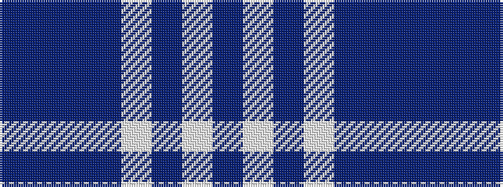

BBBBWBWB

It is a 8 stripe tartan.

<figure class="pat-woven">

<figcaption>idealised sample</figcaption>
</figure>

## Colour Sequence



## Tartans with this colour sequence

| Tartans |
|---------------|
| [Antigonish](/variants/s8/t4db1t4db24w6db4w1db2~x4/)|
||
