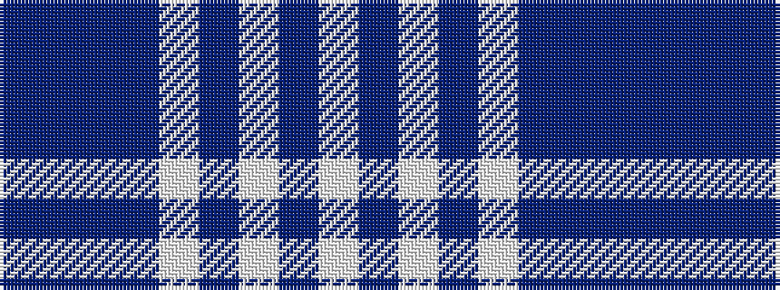

BBBBWBWBW

It is a 9 stripe tartan.

<figure class="pat-woven">

<figcaption>idealised sample</figcaption>
</figure>

## Colour Sequence



## Tartans with this colour sequence

| Tartans |
|---------------|
| [Lindsay (Dance)](/setts/s9/w29n2w2n2w2n14dr31n2dr3~x2/)|
||
