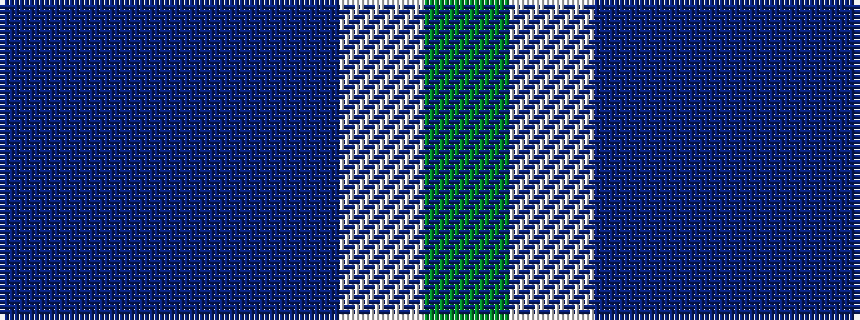

BBBBWG

It is a 6 stripe tartan.

<figure class="pat-woven">

<figcaption>idealised sample</figcaption>
</figure>

## Colour Sequence



## Tartans with this colour sequence

| Tartans |
|---------------|
| [Craig Devlin (Dundee) (Personal)](/setts/s6/dg8w3dt6db11dt30db5~x2/)|
||
| [Devlin, Craig (Personal)](/setts/s6/g8w3n6db11n30db5~x2/)|
||
