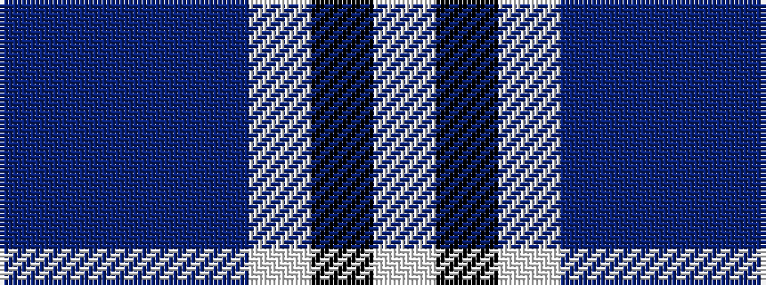

BBBBWKW

It is a 7 stripe tartan.

<figure class="pat-woven">

<figcaption>idealised sample</figcaption>
</figure>

## Colour Sequence



## Tartans with this colour sequence

| Tartans |
|---------------|
| [Lennox Purple Dress District Tartan](/variants/s7/dp8db2dp24db5w26k2w8~x2/)|
||
| [Lennox Turquoise Dress District Tartan](/variants/s7/t8db2t24db5w26k2w8~x2/)|
||
