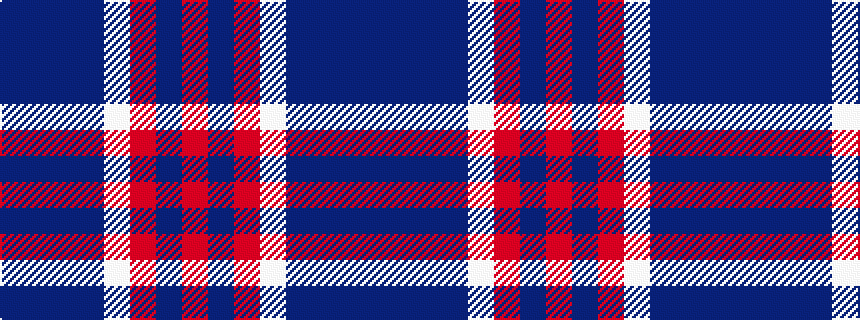

BBBBWRBR

It is a 8 stripe tartan.

<figure class="pat-woven">

<figcaption>idealised sample</figcaption>
</figure>

## Colour Sequence



## Tartans with this colour sequence

| Tartans |
|---------------|
| [Bannockbane Silver](/variants/s8/db3dr2db18dr1w10o18dr2o3~x2/)|
||
