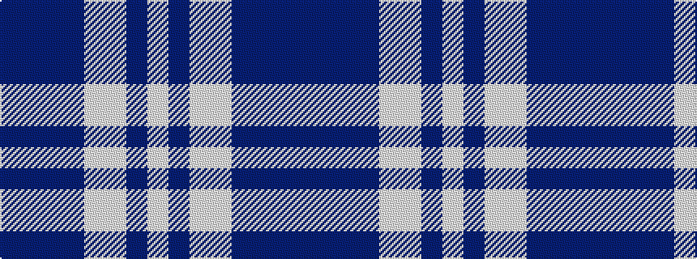

BBBBWWBW

It is a 8 stripe tartan.

<figure class="pat-woven">

<figcaption>idealised sample</figcaption>
</figure>

## Colour Sequence



## Tartans with this colour sequence

This pattern is a design lineage: every tartan below shares one colour order, whatever its owner —
near-identical designs are grouped, the largest lineage first (#112: the pattern is a tartan's
second parent, beside its family or clan).

<table class="sett-table">
<tbody>
<tr><td><a href="/variants/s8/db3dbi2db14dbi1lbi10lb16dbi2lb3~x2~db1106275-dbi1406275-lbi3200000-lb3103284/">Bannockbane Blue #2</a></td></tr>
<tr><td class="sett-swatch"></td></tr>
<tr><td><a href="/variants/s8/b3t2b30t1w18lb14t2lb3~x2/">Bannockbane Blue #3</a></td></tr>
<tr><td class="sett-swatch"></td></tr>
</tbody>
</table>

