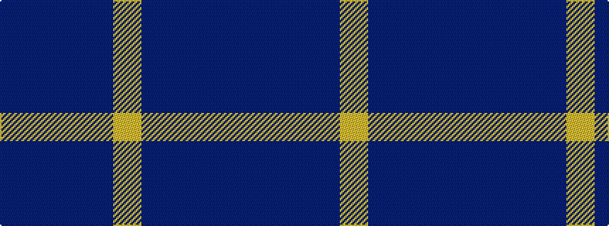

BBBBY

It is a 5 stripe tartan.

<figure class="pat-woven">

<figcaption>idealised sample</figcaption>
</figure>

## Colour Sequence



## Tartans with this colour sequence

| Tartans |
|---------------|
| [North Sea Commission](/variants/s5/t9dt3t1dt12ly1~x4/)|
||
