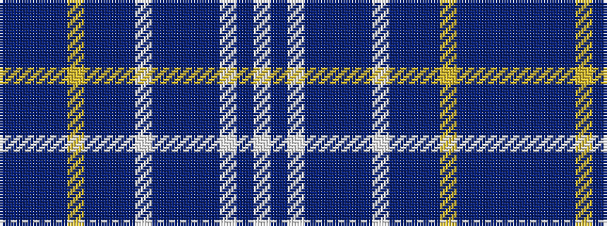

BBBBYBBBWBBBBWBW

It is a 16 stripe tartan.

<figure class="pat-woven">

<figcaption>idealised sample</figcaption>
</figure>

## Colour Sequence



## Tartans with this colour sequence

| Tartans |
|---------------|
| [Henbury](/setts/s16/dp50dt75dp75dt12ly12dp75dt75dp50w12dt12dp75dt75dp50w12dt12w12/)|
||
