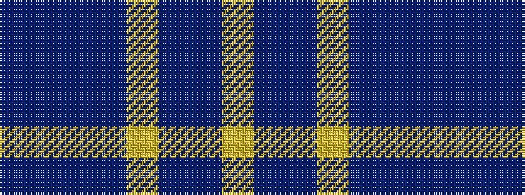

BBBBYBBY

It is a 8 stripe tartan.

<figure class="pat-woven">

<figcaption>idealised sample</figcaption>
</figure>

## Colour Sequence



## Tartans with this colour sequence

| Tartans |
|---------------|
| [Munster Ancestry](/setts/s8/do4t48do21t14lo3t6do1ly3~x2/)|
||
