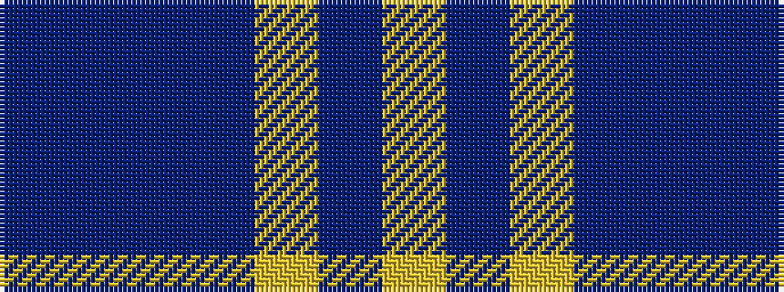

BBBBYBY

It is a 7 stripe tartan.

<figure class="pat-woven">

<figcaption>idealised sample</figcaption>
</figure>

## Colour Sequence



## Tartans with this colour sequence

| Tartans |
|---------------|
| [Danzas](/variants/s7/ly4b3ly1b17db40b2db3~x2/)|
||
| [Danzas](/variants/s7/ly4dt3ly1dt17db40dt2db3~x2/)|
||
