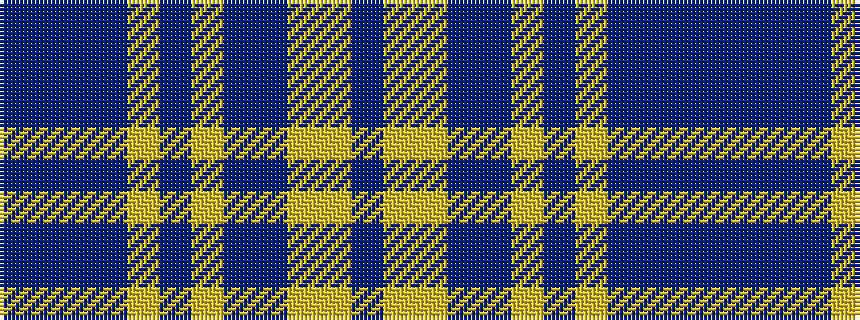

BBBBYBYBBYYB

It is a 12 stripe tartan.

<figure class="pat-woven">

<figcaption>idealised sample</figcaption>
</figure>

## Colour Sequence



## Tartans with this colour sequence

| Tartans |
|---------------|
| [Scottish Foundation VA Highlands (Co](/variants/s12/dp5ly2lr36db3dbi3ly2dp4lr3t2dbi3db3dbi3~x2/)|
||
