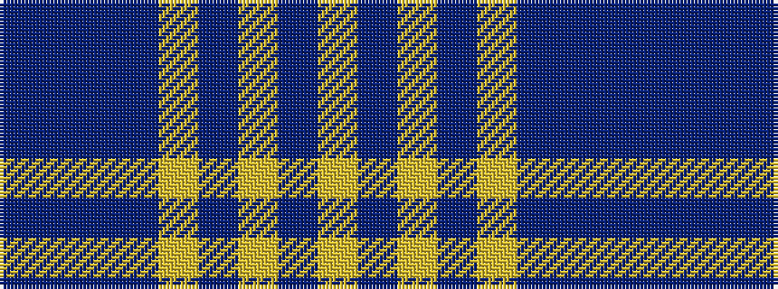

BBBBYBYBY

It is a 9 stripe tartan.

<figure class="pat-woven">

<figcaption>idealised sample</figcaption>
</figure>

## Colour Sequence



## Tartans with this colour sequence

| Tartans |
|---------------|
| [Lochearn (Fashion)](/setts/s9/lg22db3lg3db3lg3db9t22db3t6~x2/)|
||
