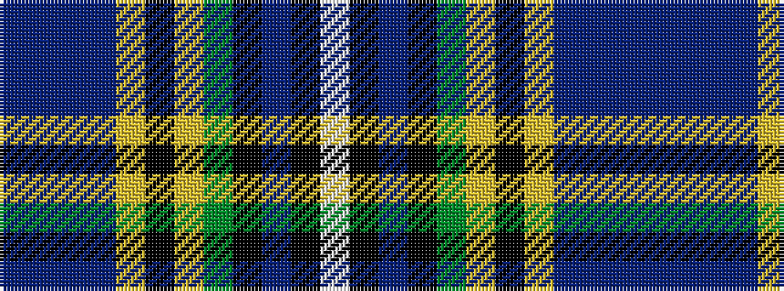

BBBBYKYGKBKW

It is a 12 stripe tartan.

<figure class="pat-woven">

<figcaption>idealised sample</figcaption>
</figure>

## Colour Sequence



## Tartans with this colour sequence

| Tartans |
|---------------|
| [Tanzania](/setts/s12/db4b1db2b16ly2k8ly2g16k1db24k1w4~x2/)|
||
