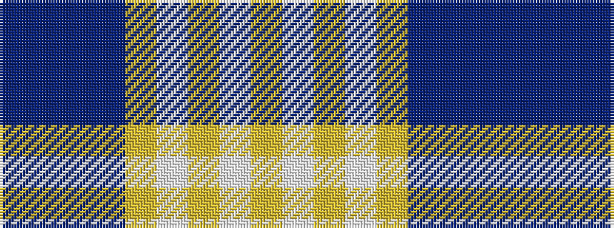

BBBBYWYWY

It is a 9 stripe tartan.

<figure class="pat-woven">

<figcaption>idealised sample</figcaption>
</figure>

## Colour Sequence



## Tartans with this colour sequence

| Tartans |
|---------------|
| [MacGrath (Personal)](/setts/s9/ly6w1ly5w12ly1db1t1db1t4~x4/)|
||
