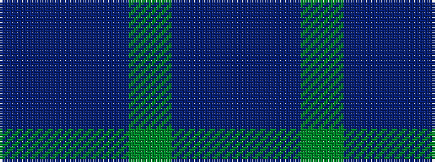

BBBGBB

It is a 6 stripe tartan.

<figure class="pat-woven">

<figcaption>idealised sample</figcaption>
</figure>

## Colour Sequence



## Tartans with this colour sequence

| Tartans |
|---------------|
| [Bouncing Blackie (Personal)](/variants/s6/db13dt13dg21db34dt55do3/)|
||
