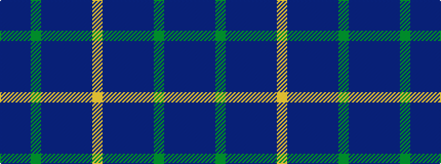

BBBGBBBBBY

It is a 10 stripe tartan.

<figure class="pat-woven">

<figcaption>idealised sample</figcaption>
</figure>

## Colour Sequence



## Tartans with this colour sequence

| Tartans |
|---------------|
| [Rikaco Heirloom (Fashion)](/variants/s10/dbi3db3dbi1g26dbi10n1dbi3dp5db4lo2~x2/)|
||
