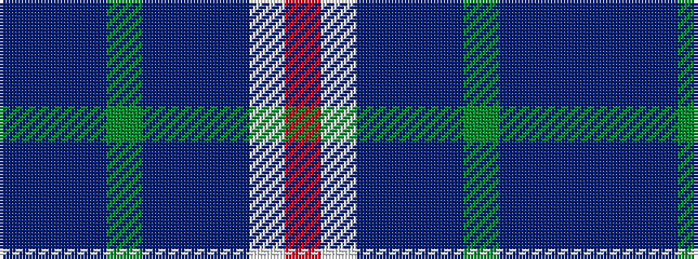

BBBGBBBWR

It is a 9 stripe tartan.

<figure class="pat-woven">

<figcaption>idealised sample</figcaption>
</figure>

## Colour Sequence



## Tartans with this colour sequence

| Tartans |
|---------------|
| [Musselburgh Dress (Dance)](/setts/s9/t14db1n3g1n3db1n4w24r1~x4/)|
||
