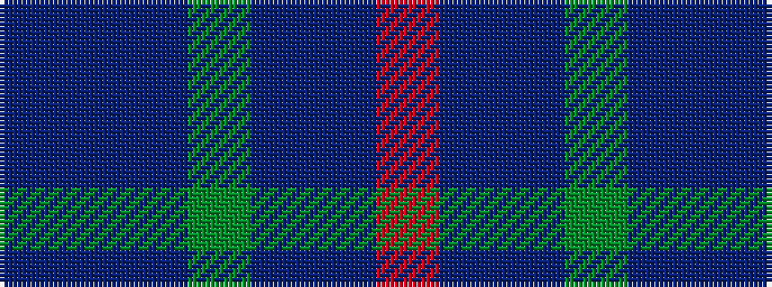

BBBGBBR

It is a 7 stripe tartan.

<figure class="pat-woven">

<figcaption>idealised sample</figcaption>
</figure>

## Colour Sequence



## Tartans with this colour sequence

| Tartans |
|---------------|
| [Bouncing Blackie (Personal)](/setts/s7/dp5db8dt13g21db34dt55o3/)|
||
