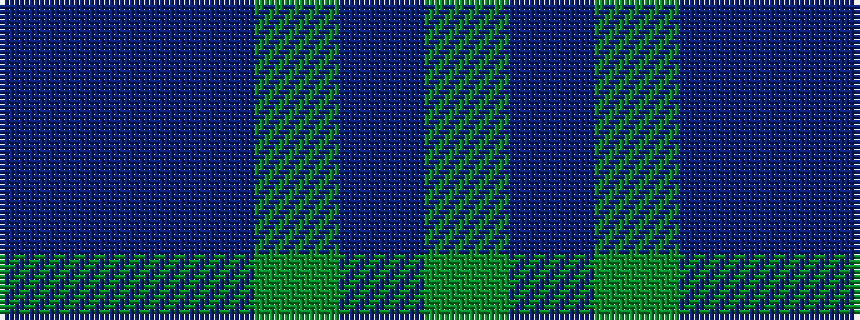

BBBGBG

It is a 6 stripe tartan.

<figure class="pat-woven">

<figcaption>idealised sample</figcaption>
</figure>

## Colour Sequence



## Tartans with this colour sequence

| Tartans |
|---------------|
| [House of Bruar (Corporate)](/setts/s6/dr6do26dt28g26dt8y3~x2/)|
||
