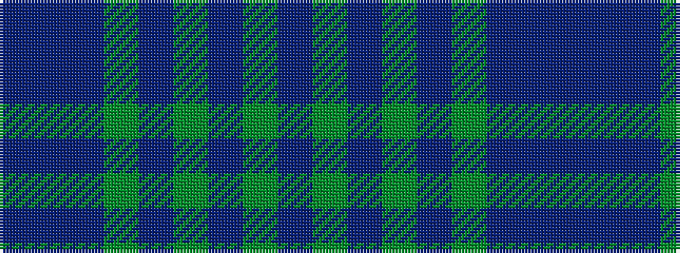

BBBGBGBGB

It is a 9 stripe tartan.

<figure class="pat-woven">

<figcaption>idealised sample</figcaption>
</figure>

## Colour Sequence



## Tartans with this colour sequence

| Tartans |
|---------------|
| [Breckon Hunting](/setts/s9/dt3dr1dt14dg14dr1dg1dr1dg1dr2~x4/)|
||
