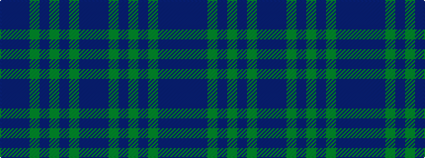

BBBGBGBGBB

It is a 10 stripe tartan.

<figure class="pat-woven">

<figcaption>idealised sample</figcaption>
</figure>

## Colour Sequence



## Tartans with this colour sequence

This pattern is a design lineage: every tartan below shares one colour order, whatever its owner —
near-identical designs are grouped, the largest lineage first (#112: the pattern is a tartan's
second parent, beside its family or clan).

<table class="sett-table">
<tbody>
<tr><td><a href="/variants/s10/b3n30g8b2g2b2g2b8n7b2~x2/">Gray</a></td></tr>
<tr><td class="sett-swatch"></td></tr>
<tr class="cluster-sep"><td></td></tr>
<tr><td><a href="/variants/s10/dr3n30g8dr2g2dr2g2dr8n7dr2~x2/">Gray Family Tartan</a></td></tr>
<tr><td class="sett-swatch"></td></tr>
<tr class="cluster-sep"><td></td></tr>
<tr><td><a href="/variants/s10/do26dt28g26dt8y3dt8g26dt28do26dr6~x2/">House of Bruar</a></td></tr>
<tr><td class="sett-swatch"></td></tr>
<tr class="cluster-sep"><td></td></tr>
<tr><td><a href="/variants/s10/db2dp26dg26db2dg3db2dg3db14dp2db2~x2/">Wcwm 1527-2</a></td></tr>
<tr><td class="sett-swatch"></td></tr>
</tbody>
</table>

