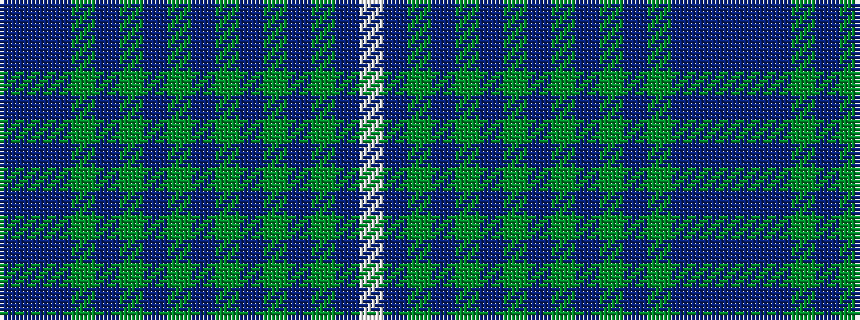

BBBGBGBGBGBGBGBW

It is a 16 stripe tartan.

<figure class="pat-woven">

<figcaption>idealised sample</figcaption>
</figure>

## Colour Sequence



## Tartans with this colour sequence

| Tartans |
|---------------|
| [Bell-McTier Thistle (Personal)](/setts/s16/b8db6dp40g16db1g7b2g5b4g4b4g2b5g1b36w6/)|
||
