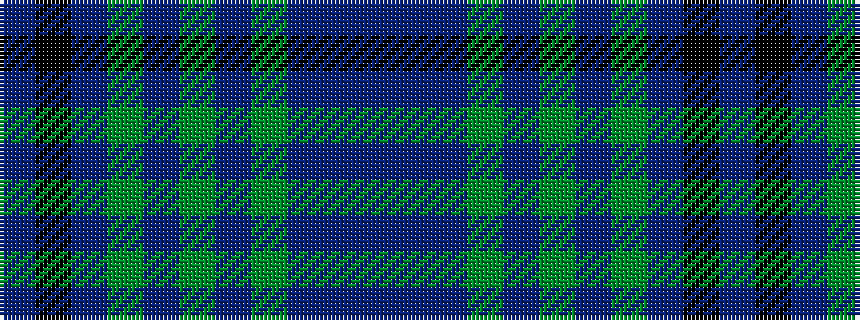

BBBGBGBGBKB

It is a 11 stripe tartan.

<figure class="pat-woven">

<figcaption>idealised sample</figcaption>
</figure>

## Colour Sequence



## Tartans with this colour sequence

| Tartans |
|---------------|
| [Paxton Tartan Tartan Number: 6691. Earliest known date: 2004 Thread samples supplied See products available Copyright © Blair Urquhart, Comrie, 2015](/setts/s11/dt30dp4dt5dg3dt2dg2dt2dg10dp7k2dp9~x2/)|
||
