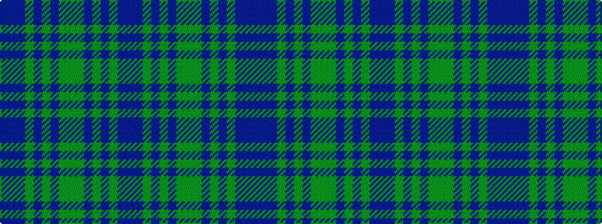

BBBGBGBGGGBGBGBB

It is a 16 stripe tartan.

<figure class="pat-woven">

<figcaption>idealised sample</figcaption>
</figure>

## Colour Sequence



## Tartans with this colour sequence

| Tartans |
|---------------|
| [Cowal Highland Games Corporate Tartan](/variants/s16/dti9dt8y1dt1y1dt1y8dg2y8dt1y1dt1y1dt8dti9n1~x4/)|
||
