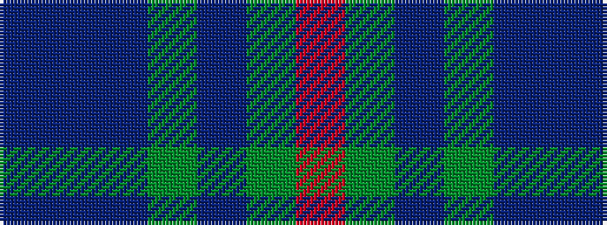

BBBGBGR

It is a 7 stripe tartan.

<figure class="pat-woven">

<figcaption>idealised sample</figcaption>
</figure>

## Colour Sequence



## Tartans with this colour sequence

| Tartans |
|---------------|
| [Boroughmuir](/variants/s7/db6b47db22g47dp4g4o4/)|
||
