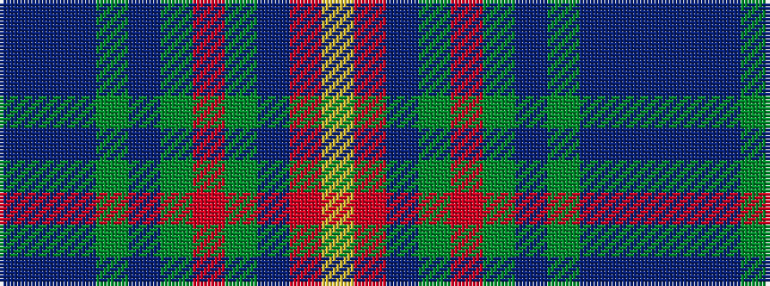

BBBGBGRGBRY

It is a 11 stripe tartan.

<figure class="pat-woven">

<figcaption>idealised sample</figcaption>
</figure>

## Colour Sequence



## Tartans with this colour sequence

| Tartans |
|---------------|
| [Telfer, Jamie of the Fair Dodhead](/setts/s11/b1db5dp6dg2dp1dg12r1dg2dp1r5lo1~x4/)|
||
