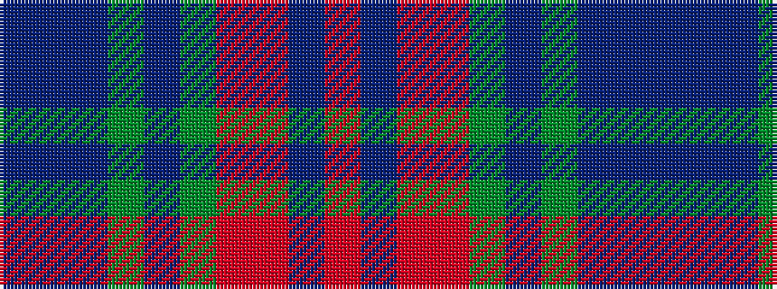

BBBGBGRRBR

It is a 10 stripe tartan.

<figure class="pat-woven">

<figcaption>idealised sample</figcaption>
</figure>

## Colour Sequence



## Tartans with this colour sequence

| Tartans |
|---------------|
| [Clarks No.1](/setts/s10/dt5t2dt11y2dt2y6o17oi9dt1o1~x2/)|
||
