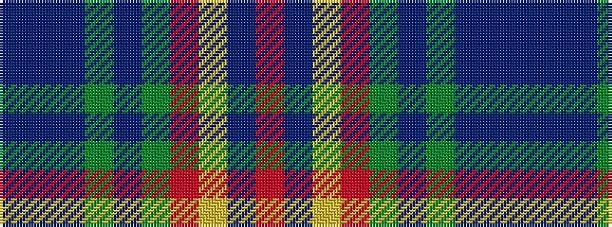

BBBGBGRYBR

It is a 10 stripe tartan.

<figure class="pat-woven">

<figcaption>idealised sample</figcaption>
</figure>

## Colour Sequence



## Tartans with this colour sequence

| Tartans |
|---------------|
| [Clarks No. 1 (Fashion)](/variants/s10/db5t2db11g2db2g6r17lo9db1r1~x2/)|
||
