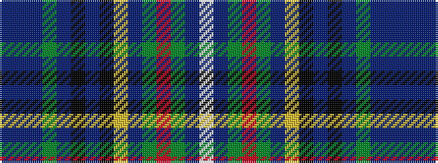

BBBGBKBKYBGRGBW

It is a 15 stripe tartan.

<figure class="pat-woven">

<figcaption>idealised sample</figcaption>
</figure>

## Colour Sequence



## Tartans with this colour sequence

| Tartans |
|---------------|
| [Dickson (Personal)](/variants/s15/db8t8db6g8db14k14db8k14ly4db60g4r4g4db13w4/)|
||
