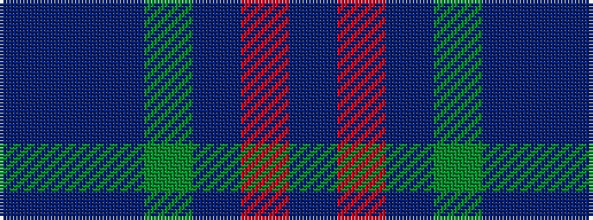

BBBGBRB

It is a 7 stripe tartan.

<figure class="pat-woven">

<figcaption>idealised sample</figcaption>
</figure>

## Colour Sequence



## Tartans with this colour sequence

| Tartans |
|---------------|
| [Bermuda Plaid (1947) (District)](/setts/s7/t33r8db12g12t8db2t8~x2/)|
||
