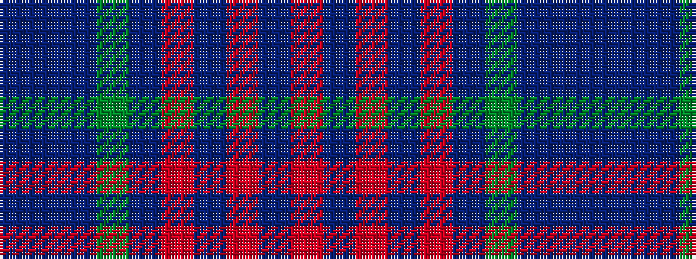

BBBGBRBRBR

It is a 10 stripe tartan.

<figure class="pat-woven">

<figcaption>idealised sample</figcaption>
</figure>

## Colour Sequence



## Tartans with this colour sequence

| Tartans |
|---------------|
| [Rikaco Classic (Fashion)](/setts/s10/db4b4db1dg24db10r1db2ri5b3r2~x2/)|
||
