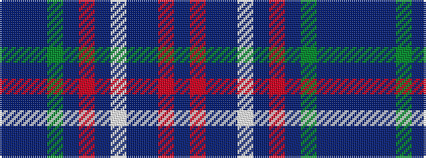

BBBGBRBWBBRB

It is a 12 stripe tartan.

<figure class="pat-woven">

<figcaption>idealised sample</figcaption>
</figure>

## Colour Sequence



## Tartans with this colour sequence

| Tartans |
|---------------|
| [MacDonald of Glencoe (Dance)](/setts/s12/dp6r2dp2db2w35db12o2dp25g3dp4db2dp4~x2/)|
||
