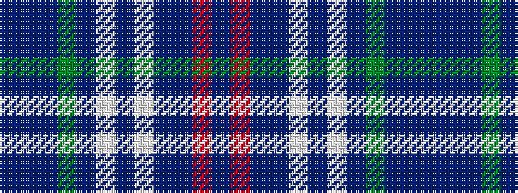

BBBGBWBWBBRB

It is a 12 stripe tartan.

<figure class="pat-woven">

<figcaption>idealised sample</figcaption>
</figure>

## Colour Sequence



## Tartans with this colour sequence

| Tartans |
|---------------|
| [MacDonald of Glencoe (Dance) Fashion Tartan Tartan Number: 6553. Earliest known date: 01/01/2005 Threadcount taken from DC Dalgliesh Dancers' Swatch book, 2005./Threadcount and colours aren't 100% original. Generated manually./ See products available Copyright © Blair Urquhart, Comrie, 2015](/setts/s12/p6r2p2dt2w31dt12lb2p26g3p4db2p4~x2/)|
||
