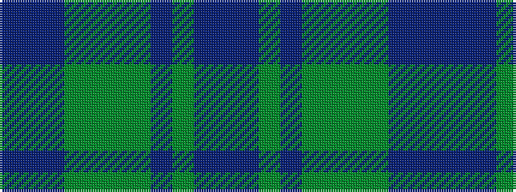

BBBGGGGBGBB

It is a 11 stripe tartan.

<figure class="pat-woven">

<figcaption>idealised sample</figcaption>
</figure>

## Colour Sequence



## Tartans with this colour sequence

| Tartans |
|---------------|
| [Fabric of Scotland (Prickly Thistle), The](/setts/s11/dpii23dp8dpi2yi24dgi19dg29y4p5y11p19p23~x2/)|
||
