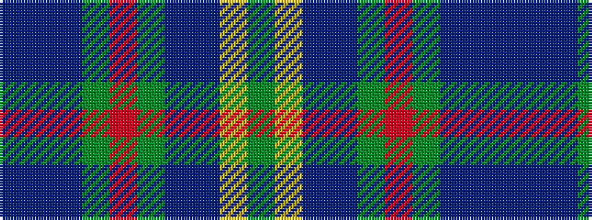

BBBGRGBBYG

It is a 10 stripe tartan.

<figure class="pat-woven">

<figcaption>idealised sample</figcaption>
</figure>

## Colour Sequence



## Tartans with this colour sequence

| Tartans |
|---------------|
| [Heriot Watt University](/variants/s10/g4ly1t3dbi15g2r2g14db1t28dbi2~x2/)|
||
| [Heriot Watt University (Corporate)](/variants/s10/dg5lo1b4dt18dg2r2dg16db1b32dt3~x2/)|
||
