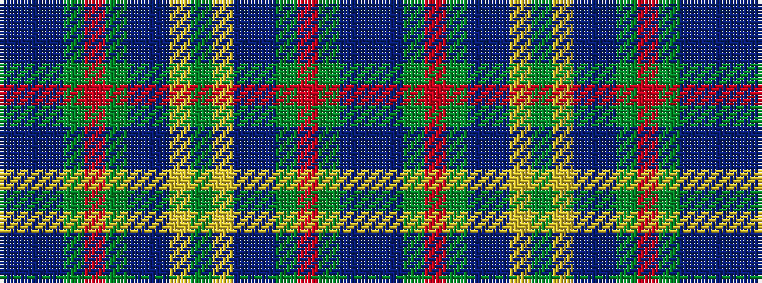

BBBGRGBBYGYBBGRGBB

It is a 18 stripe tartan.

<figure class="pat-woven">

<figcaption>idealised sample</figcaption>
</figure>

## Colour Sequence



## Tartans with this colour sequence

| Tartans |
|---------------|
| [Heriot Watt University](/setts/s18/b32db1dg16r2dg2dt18b4lo1dg5lo1b4dt18dg2r2dg16db1b32dt3~x2/)|
||
