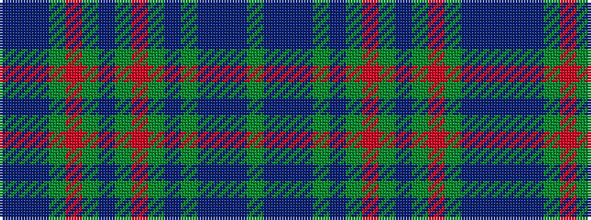

BBBGRGBGRGBGBBBG

It is a 16 stripe tartan.

<figure class="pat-woven">

<figcaption>idealised sample</figcaption>
</figure>

## Colour Sequence



## Tartans with this colour sequence

| Tartans |
|---------------|
| [Tiger](/variants/s16/g2db1b6db10g4db1g1r1g1db1g18r1g4db6b6db1~x4/)|
||
