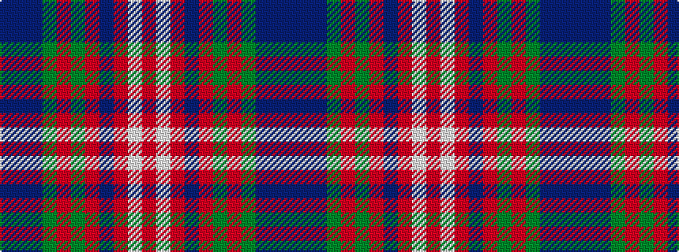

BBBGRGRBRWR

It is a 11 stripe tartan.

<figure class="pat-woven">

<figcaption>idealised sample</figcaption>
</figure>

## Colour Sequence



## Tartans with this colour sequence

| Tartans |
|---------------|
| [Hueg (Formal) (Personal)](/setts/s11/r4w4r5b4r12gi4r12g8b13dt3b4~x2/)|
||
| [Hueg (Munich) Formal (Personal)](/setts/s11/r4w4r5t4r12dgi4r12dg8t13dp3t4~x2/)|
||
