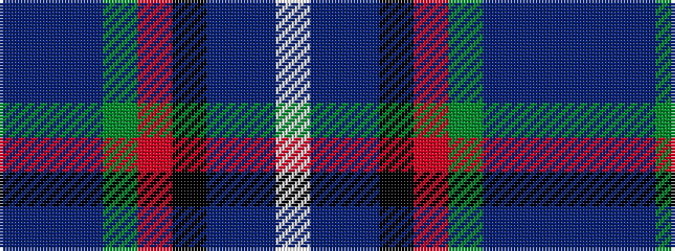

BBBGRKBBW

It is a 9 stripe tartan.

<figure class="pat-woven">

<figcaption>idealised sample</figcaption>
</figure>

## Colour Sequence



## Tartans with this colour sequence

| Tartans |
|---------------|
| [Lochranza](/variants/s9/db3n1db10g3r1k3db5n2lb1~x4/)|
||
