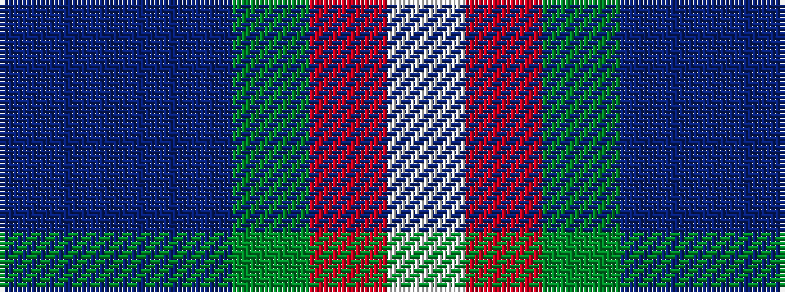

BBBGRW

It is a 6 stripe tartan.

<figure class="pat-woven">

<figcaption>idealised sample</figcaption>
</figure>

## Colour Sequence



## Tartans with this colour sequence

| Tartans |
|---------------|
| [Nicolson of Lewis (Clan?)](/variants/s6/dti3dt5n2dg5r11w3~x4/)|
||
