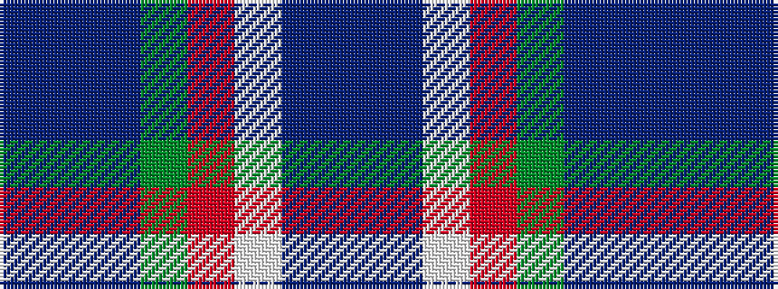

BBBGRWBB

It is a 8 stripe tartan.

<figure class="pat-woven">

<figcaption>idealised sample</figcaption>
</figure>

## Colour Sequence



## Tartans with this colour sequence

| Tartans |
|---------------|
| [St Columba](/setts/s8/db60t5w4o12g42p12t5p12/)|
||
