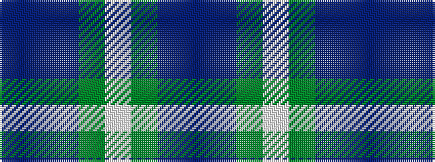

BBBGWGBB

It is a 8 stripe tartan.

<figure class="pat-woven">

<figcaption>idealised sample</figcaption>
</figure>

## Colour Sequence



## Tartans with this colour sequence

| Tartans |
|---------------|
| [Wallace Blue](/setts/s8/db29t12g29w2g29t12db29t2~x2/)|
||
