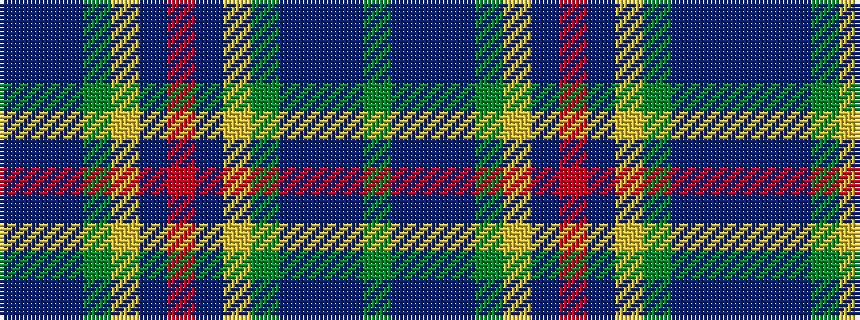

BBBGYBRBYGBBBG

It is a 14 stripe tartan.

<figure class="pat-woven">

<figcaption>idealised sample</figcaption>
</figure>

## Colour Sequence



## Tartans with this colour sequence

| Tartans |
|---------------|
| [Heather Isle](/variants/s14/y80dt16dp8dpi10y8lo1dt6o1~x2/)|
||
