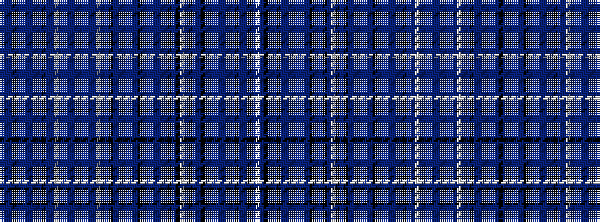

BBBKBBBBBBKBBWBBBBBBBBBWBBKBBBBBBKBBBBBBKBKWBKBBKBBBBBBBKBBKBW

It is a 62 stripe tartan.

<figure class="pat-woven">

<figcaption>idealised sample</figcaption>
</figure>

## Colour Sequence



## Tartans with this colour sequence

| Tartans |
|---------------|
| [Millennium by Texcraft](/setts/s62/db8db1db1k37db1db14db2db2db1db1k37db1db1w2db18db1db3db1db18db1db3db1db18w2db1db1k37db1db1db3db2db13db1k37db1db1db8db2db10db1k1db1k1w2db1k33db1db2k1db1db1db18db2db18db1db1k1db2db1k37db1w2~x2/)|
||
