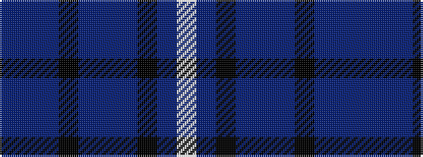

BBBKBBBKBW

It is a 10 stripe tartan.

<figure class="pat-woven">

<figcaption>idealised sample</figcaption>
</figure>

## Colour Sequence



## Tartans with this colour sequence

| Tartans |
|---------------|
| [Spirit of Wales (Fashion)](/variants/s10/dt4dp2dt22k2dt1db2dt1k2db24w2~x2/)|
||
