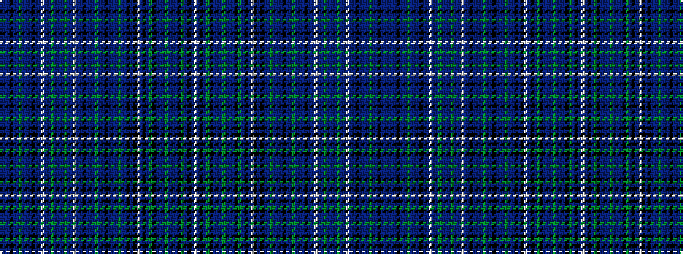

BBBKBBGBBBKBBWBBGBBBGBBWBBKBBBGBBKBBBGBBKBKWBKBGKBBBGBBBKGBKBW

It is a 62 stripe tartan.

<figure class="pat-woven">

<figcaption>idealised sample</figcaption>
</figure>

## Colour Sequence



## Tartans with this colour sequence

This pattern is a design lineage: every tartan below shares one colour order, whatever its owner —
near-identical designs are grouped, the largest lineage first (#112: the pattern is a tartan's
second parent, beside its family or clan).

<table class="sett-table">
<tbody>
<tr><td><a href="/variants/s62/db8b1db1k37b1db14dg2db2b1db1k37db1b1w2db18b1dg3b1db18b1dg3b1db18w2b1db1k37db1b1db3dg2db13b1k37db1b1db8dg2db10b1k1db1k1w2b1k33db1dg2k1db1b1db18dg2db18b1db1k1dg2db1k37b1w2~x2/">Millennium by Texcraft</a></td></tr>
<tr><td class="sett-swatch"></td></tr>
</tbody>
</table>

