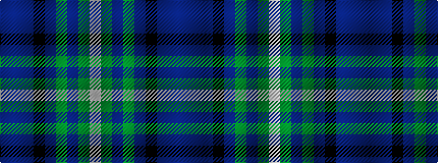

BBBKBGBGW

It is a 9 stripe tartan.

<figure class="pat-woven">

<figcaption>idealised sample</figcaption>
</figure>

## Colour Sequence



## Tartans with this colour sequence

| Tartans |
|---------------|
| [Halcrow Howell](/setts/s9/bi4b3bi6k2db12g2db2g24lb2~x2/)|
||
| [Halcrow Howell (Name)](/setts/s9/db4t3db6k2dbi12g2dbi2g24lb2~x2/)|
||
