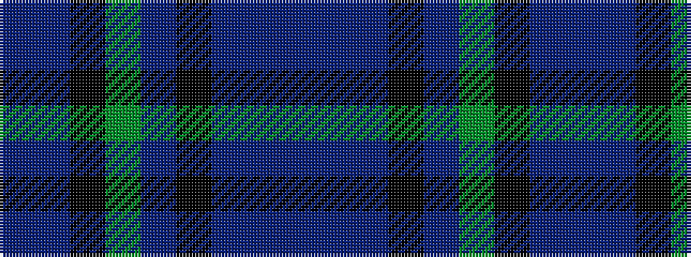

BBBKBGKBB

It is a 9 stripe tartan.

<figure class="pat-woven">

<figcaption>idealised sample</figcaption>
</figure>

## Colour Sequence



## Tartans with this colour sequence

| Tartans |
|---------------|
| [Fermanagh (1990)](/setts/s9/n44do4n1k1n4y4k1db4do4~x2/)|
||
