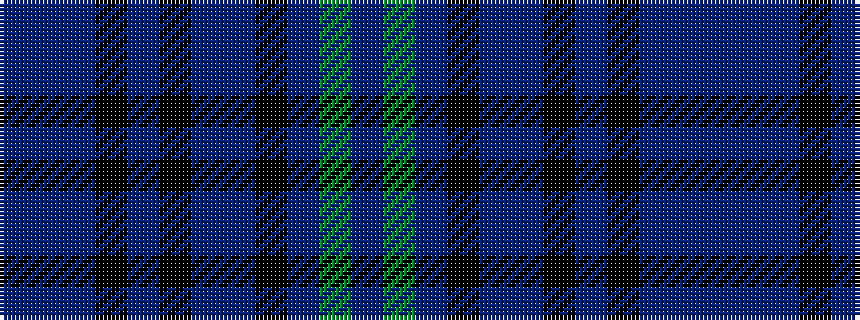

BBBKBKBBKBGB

It is a 12 stripe tartan.

<figure class="pat-woven">

<figcaption>idealised sample</figcaption>
</figure>

## Colour Sequence



## Tartans with this colour sequence

| Tartans |
|---------------|
| [Scotland's Own (Fashion)](/setts/s12/db4y1db30k15dp4db2k2db2k10db4dp2db2~x2/)|
||
