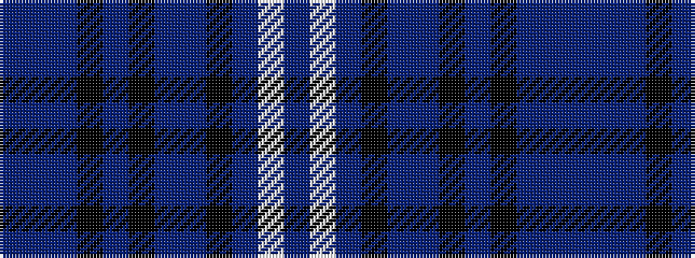

BBBKBKBBKBWB

It is a 12 stripe tartan.

<figure class="pat-woven">

<figcaption>idealised sample</figcaption>
</figure>

## Colour Sequence



## Tartans with this colour sequence

| Tartans |
|---------------|
| [Scotland's Own](/setts/s12/db4w1db30k15p4db2k2db2k10db4p2db2~x2/)|
||
